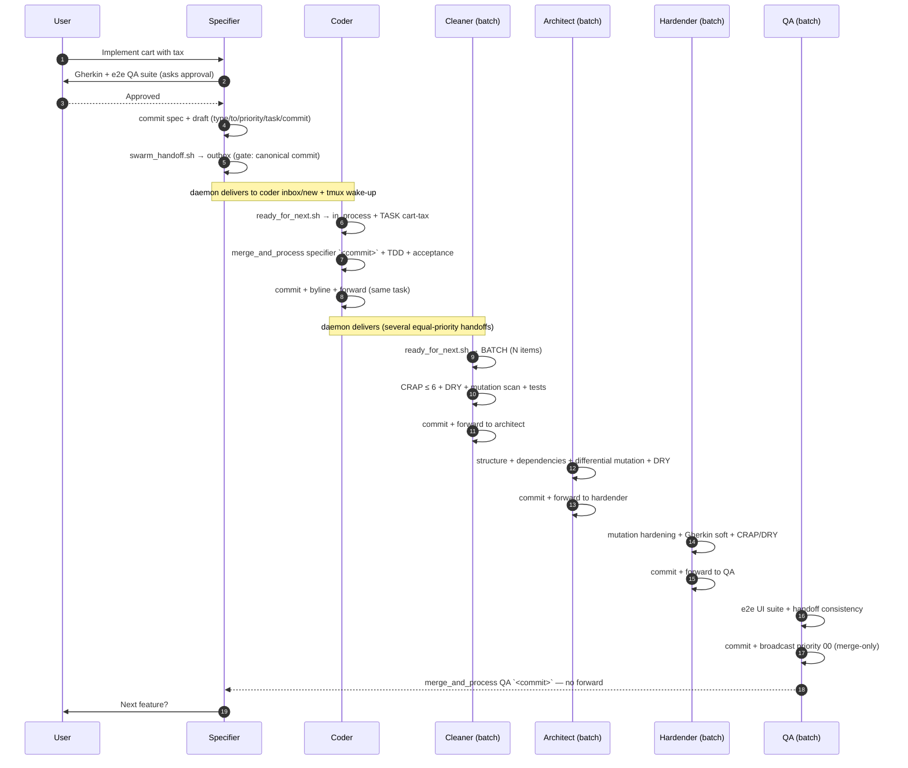
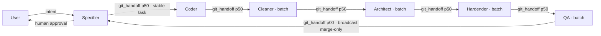
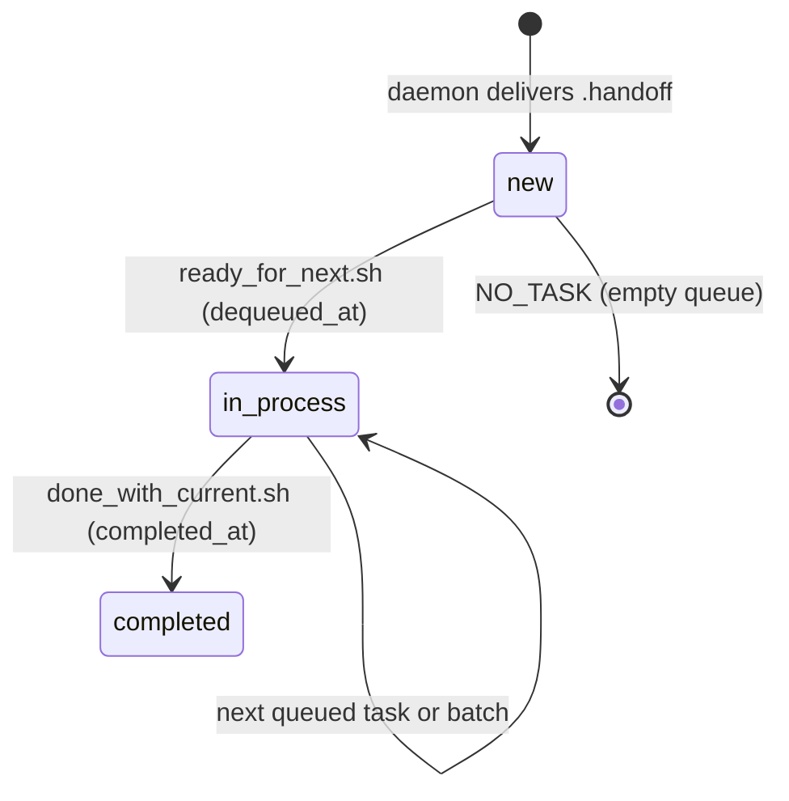

# SwarmForge — Handoff protocol and deterministic pipeline

> Working document complementary to `swarmforge.md`.
> Example based on the full `six-pack` workflow (specifier → coder → cleaner → architect → hardender → QA).

---

## 1. Handoff semantics (full example)

**Task**: *"Implement a shopping cart with tax calculation"* → stable task name: **`cart-tax`**. That name travels the entire chain unchanged.

### 1.1 The message contract

Only **two message types** exist, and only the headers the agent may write:

```text
type: git_handoff      →  "I committed work; merge and process it"
to: coder
priority: 50           →  00 = urgent · 50 = normal · 99 = low
task: cart-tax         →  stable name that travels the chain
commit: 3f9a2c1d7e     →  canonical 10-hex hash (the gate validates and canonicalizes it)
```

```text
type: note             →  short message (only if the constitution/role authorizes it)
to: architect
priority: 70
message: <1 line, max 80 chars>
```

Agents **never write the payload or reserved headers** (`id`, `from`, `role`, `recipient`, `created_at`, `enqueued_at`…): the tool generates all of that.

### 1.2 The specifier opens the chain

The specifier talks with you, writes `features/cart.feature` (Gherkin) + the end-to-end QA suite, and **asks for your explicit approval**. Only after your OK does it commit and write its draft:

```text
type: git_handoff
to: coder
priority: 50
task: cart-tax
commit: 3f9a2c1d7e
```

It runs `swarm_handoff.sh draft` → the **validation gate** does 4 checks: `coder` is a known role, `50` is a valid priority, the commit **resolves to exactly one object and is a commit** (via `git rev-parse --disambiguate`), and there are no reserved fields or agent-written body. It generates the payload and installs it atomically in the outbox:

```text
50_20260710T120000Z_000042_from_specifier_to_coder.handoff
```

The **daemon** (1 s polling) copies the file to the coder's `inbox/new/` **adding delivery headers**, and wakes the coder by typing into its tmux pane: *"You have new handoff mail. If idle, run ready_for_next.sh."* + Enter.

The delivered file (this is what the coder sees):

```text
id: 20260710T120000Z_000042_from_specifier
from: specifier
to: coder
recipient: coder            ← added by the daemon (per-recipient copy)
priority: 50
type: git_handoff
role: specifier
task: cart-tax
commit: 3f9a2c1d7e
created_at: 2026-07-10T12:00:00Z
enqueued_at: 2026-07-10T12:00:01Z  ← added by the daemon

Re-read your role and constitution.

merge_and_process specifier 3f9a2c1d7e
```

### 1.3 The coder consumes the task

The coder runs `ready_for_next.sh` → the helper moves the file from `inbox/new/` to `inbox/in_process/`, **adds `dequeued_at`**, and prints:

```text
TASK: .swarmforge/handoffs/inbox/in_process/50_..._from_specifier_to_coder.handoff
FROM: specifier
TYPE: git_handoff
PRIORITY: 50
TASK_NAME: cart-tax
PAYLOAD:
Re-read your role and constitution.

merge_and_process specifier 3f9a2c1d7e
```

The coder does `merge_and_process specifier 3f9a2c1d7e` (merge of the specification commit), applies **TDD** (unit tests first, then implementation), runs the acceptance tests generated from the Gherkin, commits with byline (*"Implement cart tax" — `By coder.`*) and **forwards along the chain** with the same `task: cart-tax` and its new commit. Key rule: **an intermediate role ALWAYS forwards**, no matter what (even if the change is format-only).

### 1.4 The cleaner in batch mode

The cleaner is configured in `swarmforge.conf` with `batch`. If 3 handoffs arrive from the coder at the same priority, `ready_for_next_batch.sh` groups them:

```text
BATCH: .swarmforge/handoffs/inbox/in_process/batch_20260710T130000Z_000051
COUNT: 3
PRIORITY: 50
BATCH_ITEM: 1  → TASK_NAME: cart-tax ...
BATCH_ITEM: 2  → TASK_NAME: user-auth ...
BATCH_ITEM: 3  → TASK_NAME: cart-coupon ...
```

It processes all 3 as **one cleanup pass**: coverage, CRAP ≤ 6, DRY, mutation site scan (split files with >100 sites), acceptance + unit tests, commits, and forwards **once** to the architect.

### 1.5 The chain continues (architect → hardender → QA)

Each with the same mechanics: `ready_for_next.sh` (task or batch) → process its gate → verify → commit with byline → forward along the chain with `task: cart-tax` preserved.

### 1.6 QA closes: the "terminal broadcast"

When QA verifies everything (e2e UI suite, commit/manifest consistency, final CRAP/DRY), it commits and sends **a single handoff to multiple recipients** with `priority: 00`:

```text
type: git_handoff
to: specifier,coder,cleaner,architect,hardender
priority: 00
task: cart-tax
commit: b4d8e2f1a0
```

This is the **exception to the forwarding rule**: each recipient does `merge_and_process QA b4d8e2f1a0`, runs its tests, and **does NOT forward**. The specifier, on receiving the broadcast, merges and asks you for the next feature. Chain closed.

### 1.7 Each task's state machine

```text
inbox/new/ ──ready_for_next──► inbox/in_process/ ──done_with_current──► inbox/completed/
   (daemon delivery)            (+dequeued_at)        (+completed_at)
```

- `done_with_current.sh` **picks up the next task or batch automatically** if there is a queue → agents do not sit idle.
- If a wake-up arrives while the agent is working → **it is ignored**; the queue is not lost because state lives in files.
- Swarm restart → agents re-run `ready_for_next.sh` and resume from `in_process`.

---

## 2. Rules for a deterministic pipeline

Determinism does not come from one place: it comes from **four layers of rules** that reinforce each other.

### 2.1 Layer 1 — Shared rules (constitution)

**`workflow.prompt`** (work discipline):

- Each role works **only in its assigned worktree/branch**; forbidden to diff/merge foreign branches except via explicit handoff.
- Every commit carries a byline: `By <role>.`
- Temporary files under `./tmp/` of the worktree, not `/tmp`.
- If the expected git layout does not exist → **stop and report**, do not improvise.

**`handoffs.prompt`** (protocol):

- Only `git_handoff` and `note`; notes require explicit authorization.
- On ambiguity/contradiction → **stop and ask**, do not send notes.
- **Mandatory chain forwarding**: each intermediate role forwards to the next stage after completing, even if the change is non-functional (format, manifests, metadata).
- **Terminal broadcast = merge-only**: recipients of the final handoff do not forward.
- `task:` is preserved when forwarding; invent a stable name only for new work.
- Forbidden to edit/add/commit handoff runtime state.

**`engineering.prompt`** (technical rules):

- TDD: unit tests first, then minimal production to pass.
- Quality tools (mutation/CRAP/DRY/coverage) run only on **testable modules**; "environmentally unsuitable" modules remain as excluded adapters.
- Acceptance via `gherkin-parser` (APS) — forbidden to reimplement the parser.
- Local verification before each handoff; verification commands never concurrent with each other.
- Guardrails: do not edit mutation manifests by hand; do not commit unrelated artifacts.

### 2.2 Layer 2 — Per-role rules (six-pack)

| Role | Owns | **Does Not Own** (boundary) | Verification before handoff | Handoff obligation |
|---|---|---|---|---|
| **specifier** | Gherkin + acceptance criteria + e2e QA suite | Does not run mutation or quality tools | Tests if needed; **nothing more** | **Does not commit or forward without your approval**. After your OK: commit + handoff to coder with invented `task:` |
| **coder** | Implementation of approved slices with TDD | QA suite, mutation, CRAP/DRY, Gherkin mutation | Unit tests + acceptance tests | Commit + handoff to cleaner |
| **cleaner** (batch) | Cleanup preserving behavior: names, duplication, boundaries, coverage | Mutation tests, Gherkin mutation, **new behavior** | CRAP ≤ 6, DRY, mutation site scan, acceptance + unit | Commit + handoff to architect **before taking another task/batch** |
| **architect** (batch) | Structure, boundaries, dependency direction, mutation hardening, DRY, property tests | — (inherits the chain) | Per-file mutation (differential), DRY, property tests, Gherkin soft | Commit + handoff to hardender |
| **hardender** (batch) | Mutation hardening (kill survivors), Gherkin mutation, final CRAP/DRY | Specifier's e2e QA suite | Mutation → Gherkin soft → CRAP → DRY | Commit + handoff to QA |
| **QA** (batch) | Independent final verification, turn QA suite into executable scripts, e2e via UI | Mutation and Gherkin mutation | e2e UI suite, handoff/manifest consistency, CRAP/DRY | Commit + **broadcast priority 00 to all** (merge-only) |

### 2.3 Layer 3 — Transport rules (the gate)

- `swarm_handoff.sh` **rejects** drafts with: reserved fields, unknown roles, non-numeric priority (00–99), ambiguous or non-commit commits, `task` > 80 chars, agent-written bodies. The agent repairs and retries; nothing malformed enters the queue.
- Priorities: **50** = normal chain progress, **00** = terminal broadcast / urgent follow-up work. The queue orders by `priority_timestamp_sequence`, so order is **deterministic even if they arrive in the same second**.
- `batch` roles consume **all equal-priority handoffs as one unit** → cleaner/reviewer does not interrupt its pass for each delivery.
- Agents **do not talk to tmux**: the daemon is the only one with socket access; agents only write files to their outbox. Control channel and state channel are separated.

### 2.4 Layer 4 — State rules (the queue as a state machine)

- `new → in_process → completed` with audit timestamps (`enqueued_at`, `dequeued_at`, `completed_at`).
- **Resumption**: state lives in files, not memory — you restart the swarm and `ready_for_next.sh` resumes from `in_process`.
- `done_with_current.sh` **chains the next task** automatically → the pipeline advances without human intervention between gates.

### 2.5 Where determinism comes from (summary)

1. **Closed message types** (2) and **strict validation gate** → nothing ambiguous enters the system.
2. **Mandatory chain forwarding** + **merge-only broadcast** → processing order is always the same, with no skips or loops.
3. **Ownership boundaries** ("Does Not Own") → each agent only touches its own work; nobody steps on another's (coder does not do mutation; cleaner does not introduce behavior).
4. **Mandatory verification before each handoff** → a handoff only exists if its gate passed.
5. **Worktree isolation** → each role sees only its branch; merge happens explicitly via `merge_and_process` at handoff time.
6. **Stable task name + priority + sequence** → full traceability: you can follow `cart-tax` commit by commit through the whole chain.

---

## 3. Diagrams

### 3.1 Full pipeline (six roles, `six-pack`)



### 3.2 Handoff chain and priorities



### 3.3 Task lifecycle



---

## 4. Mermaid syntax notes (validated with v11.13.0)

- In `sequenceDiagram` messages do not use `&lt;`/`&gt;` entities — use backticks: `` `<commit>` ``.
- In `flowchart` labels do not use escaped double quotes (`\"`) — use inner single quotes or plain text.
- `<br/>` does work inside sequence messages and labels.
