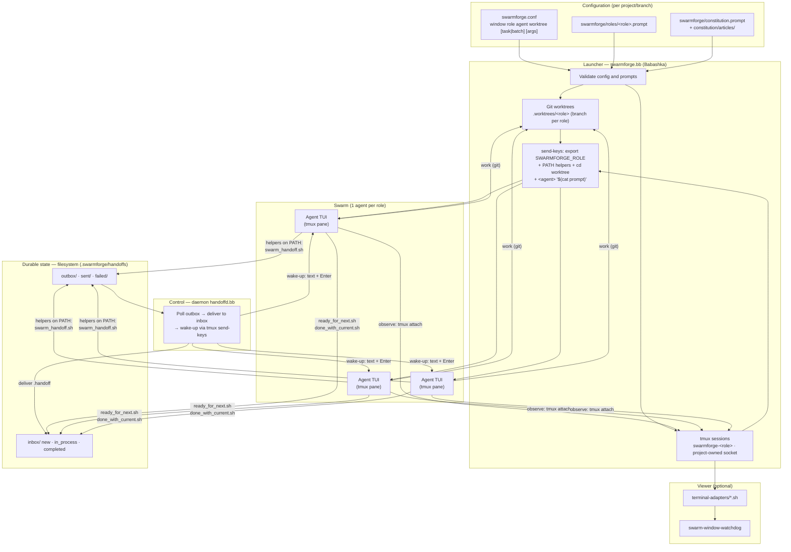
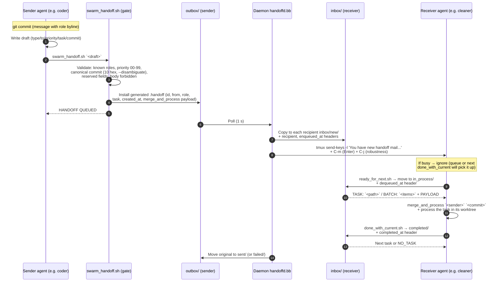
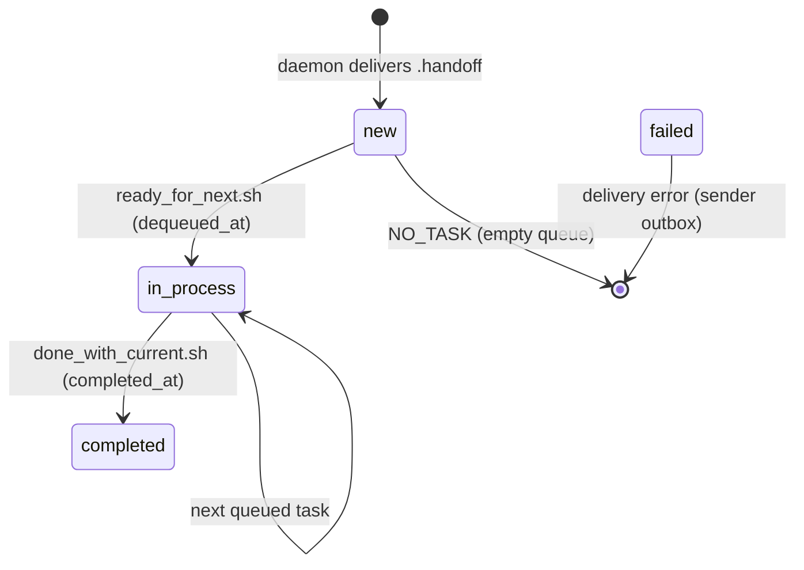

# SwarmForge — Description, protocol, and migration requirements

> Working document. Project source: https://github.com/unclebob/swarm-forge
> Goal: understand SwarmForge's architecture and evaluate adapting it to **pi** as the agent, on **Linux**, with **DeepSeek / GLM / Qwen** models.

---

## 1. Project description

**SwarmForge** is a **tmux**-based agent orchestration platform that turns a swarm of AI agents into a coordinated software engineering team. It was created by Robert C. Martin and applies his own engineering discipline (TDD, Gherkin/acceptance testing, mutation testing, CRAP/DRY analysis) to the problem of coordinating agents.

Core idea: **each agent lives in its own git worktree and its own tmux session**, and agents communicate via a **file-based handoff protocol** delivered by a daemon. There are no direct messages between agents and no direct access to the tmux socket by them.

### Branch structure

| Branch | Description | Roles |
|---|---|---|
| `main` | **Documentary**: shared operational scripts + default constitution articles | — |
| `two-pack` | Fast backend workflow (TDD + hardening, no Gherkin) | `coder` → `cleaner` → `coder` |
| `four-pack` | Compact workflow with Gherkin specification | `specifier` → `coder` → `refactorer` → `architect` → `specifier` |
| `six-pack` | Full workflow with all quality gates separated | `specifier` → `coder` → `cleaner` → `architect` → `hardender` → `QA` → end |

Each executable branch contains the project config: `swarmforge.conf` (topology), `roles/<role>.prompt` (per-role prompts) and `constitution.prompt` + articles (shared rules). On startup, the `./swarm` wrapper downloads the shared operational scripts from `main` (first time only) and launches the orchestrator.

### How it works at a high level

1. **Declarative configuration**: `swarmforge.conf` defines the swarm window by window:
   ```
   window <role> <agent> <worktree> [task|batch] [extra-args...]
   ```
2. **Launcher** (`swarmforge.bb`, Babashka): validates the config, initializes the git repo if needed, creates a **worktree per role** under `.worktrees/`, creates a **tmux session per role** on a project-owned socket and launches each agent with its initial prompt.
3. **Agents**: each runs as an interactive TUI in its tmux pane, inside its worktree, with the handoff scripts on its `PATH`.
4. **Daemon** (`handoffd.bb`): owner of the tmux socket. Watches agent outboxes, delivers handoffs to recipient inboxes and wakes agents with a message typed into their pane.
5. **Handoff protocol**: agents create validated drafts, receive them as tasks or batches (`task`/`batch`), and report completion with `done_with_current.sh`.
6. **Optional viewer**: terminal adapters (`terminal-adapters/*.sh`) open one window per role for real-time observation, with a watchdog that reopens closed windows without losing agent state.

### Key features

- **Config-driven topology**: swarm shape comes from `swarmforge.conf`, not from code.
- **Per-project roles**: `swarmforge/roles/<role>.prompt` per branch/backlog.
- **Layered constitution**: `constitution.prompt` directs agents to read articles under `swarmforge/constitution/articles/` (shared engineering, handoff and workflow rules + local per-branch rules).
- **Per-role backends**: each role can use a different agent CLI (`claude`, `codex`, `copilot`, `grok`).
- **Observable**: one terminal window per role, or headless in tmux.
- **Self-hosted and light**: only needs tmux, git, zsh and Babashka; all state lives in `.swarmforge/` inside the project.
- **Operational robustness**: host sleep prevention (`caffeinate`/`systemd-inhibit`), task resumption after restart, file-based audit (`new` → `in_process` → `completed`).

---

## 2. Handoff protocol (summary)

The protocol separates **state** (files on the filesystem, durable and auditable) from **control** (tmux, only for notification and liveness).

### Messages

Only two types, both strictly validated:

```
type: git_handoff          type: note
to: <role>[,<role>...]     to: <role>[,<role>...]
priority: NN (00-99)       priority: NN (00-99)
task: <stable-name>        message: <1 line, max 80 chars>
commit: <10 hex>
```

- `git_handoff`: the sender has committed work; the receiver does `merge_and_process <role> <commit>`.
- `note`: short message; only when the constitution or role explicitly authorizes it.

### Flow

1. The agent commits and writes a **draft** with headers only.
2. `swarm_handoff.sh` is the **validation gate**: rejects reserved fields, unknown roles, invalid priorities, ambiguous commits (canonicalizes the hash with `git rev-parse --disambiguate`) and bodies that are not generated.
3. The helper generates the payload (`id`, `from`, `role`, `task`, `created_at`, body) and installs it atomically in `outbox/`.
4. The **daemon** polls (1s), copies the handoff to each recipient's `inbox/new/` (adding `recipient` and `enqueued_at`) and wakes the receiver.
5. The receiver runs `ready_for_next.sh` → moves to `inbox/in_process/` (adds `dequeued_at`) and prints `TASK:`/`BATCH:` with the payload.
6. On completion, `done_with_current.sh` moves to `inbox/completed/` (adds `completed_at`) and picks up the next task if one exists.
7. The daemon moves the sender's original to `sent/` or `failed/`.

### Wake-up (control plane)

The daemon "wakes" an agent by typing into its tmux pane:

```
tmux send-keys -t <session> -l "You have new handoff mail. If idle, run ready_for_next.sh."
tmux send-keys -t <session> C-m    # Enter
tmux send-keys -t <session> C-j    # robustness LF
```

The agent receives it as a user message. Protocol rules: if it is already working, **ignore the wake-up**; `done_with_current.sh` picks up the next task when finished. In practice, an agent with a message queue (like pi) enqueues the wake-up and delivers it when the turn ends.

### Chain rules

- Intermediate roles **always forward** a `git_handoff` to the next role in the chain, no matter what (even if the change is non-functional).
- The final handoff of the chain (broadcast) is **merge-only**: recipients merge and do not forward.
- Task names (`task:`) are preserved along the chain.

---

## 3. Migration requirements

### 3.1 Agent contract (necessary condition)

SwarmForge requires the agent to be a **long-lived interactive process in a tmux pane** that satisfies:

1. **Interactive CLI (TUI/REPL)** that keeps running — wake-ups arrive as typed text + Enter; a one-shot CLI cannot receive work.
2. **Initial prompt via command line** (or injectable via `tmux send-keys` after startup).
3. **Work in the worktree directory** (`cd <worktree> && <agent> ...`).
4. **Ability to run commands** (the helpers `swarm_handoff.sh`, `ready_for_next.sh`, `done_with_current.sh` are shell/bb on `PATH` — they are model-agnostic).

Everything else in the protocol (handoffs, worktrees, daemon, wake-ups, watchdog) **does not know about the model**: the only integration point is the launch arm in `swarmforge.bb` and the validated backend list in `parse-config`.

### 3.2 Validation: pi as agent

**Fits out of the box.** Verified in docs and installed binary:

- `pi "<prompt>"` starts the TUI, **sends the initial message and stays interactive** (confirmed in `dist/modes/interactive/interactive-mode.js`).
- **tmux officially supported** (`docs/tmux.md`). Recommendation: tmux ≥ 3.5 with `extended-keys-format csi-u` for modified keys; the basic protocol (Enter) works with any version.
- **Compatible wake-up**: in pi `Enter` = send, `Ctrl+J` = new line (the daemon's `C-j` is harmless).
- **Message queue**: a message typed while pi is working is **enqueued and delivered when the turn ends** — ideal for the protocol's wake-up semantics.
- **Sessions**: `pi -c` (continue), `--session`, `--name "SwarmForge <Role>"` (session name).

Operational requirements with pi:

| Requirement | Detail |
|---|---|
| Trust prompt | pi asks on startup in a new project and **would block the agent**. Use `-a/--approve` in the launch arm or pre-seed `~/.pi/agent/trust.json`. |
| Fixed model | Use `--model <provider>/<model>` so each role does not start at the login selector. |
| Runtime | Node.js ≥ 22 (npm install) or standalone script; Linux supported natively. |

Proposed launch arm in `swarmforge.bb`:

```clojure
"pi" (str "pi -a --name " (sq (str "SwarmForge " display))
           " --model " (sq model) " "
           (extra-args-prefix row)
           "\"$(cat " (sq (str prompt-file)) ")\"")
```

### 3.3 Validation: opencode as agent

**Fits with a mandatory adaptation.** Verified on the real v1.18.15 binary and in source:

- `opencode` (no args) starts the persistent **interactive TUI**.
- ⚠️ The TUI **does not accept an initial message via CLI**: `--prompt` in TUI mode calls a Node `rl.question` (waits for stdin input); only `--mini --prompt` sends it as a message, but with `interactive: false` (runs and exits). `opencode run "<msg>"` is **headless one-shot** — not usable as a swarm agent.
- **Solution**: launch the TUI (`opencode --auto`) and **inject the prompt with `tmux send-keys`** after startup — the same mechanism the daemon already uses to wake. About ~10 lines in `launch-role!` (launch → sleep → `send-keys -l "$(cat prompt)"` + Enter).

```
opencode --auto -m <provider>/<model>    # in the role's tmux session
# after ~2s:
tmux send-keys -t <target> -l "<initial prompt>" ; tmux send-keys -t <target> C-m
```

Operational requirements with opencode:

| Requirement | Detail |
|---|---|
| Permissions | `--auto` (auto-approve; also the hidden aliases `--yolo` / `--dangerously-skip-permissions`) — equivalent to the swarm's autonomous mode. |
| Sessions | `-c/--continue`, `-s/--session` for the restart flow ("on restart, run ready_for_next.sh"). |
| Runtime | Static binary (npm `opencode-ai` or GitHub release); Linux supported. |
| Future | `opencode serve` + `attach`/SDK/ACP would allow a native message queue without keyboard wake-ups (would require changing the architecture, not adapting it). |

### 3.4 Models: DeepSeek / GLM / Qwen

| Model | pi | opencode |
|---|---|---|
| **DeepSeek** | **Native**: `DEEPSEEK_API_KEY`, provider `deepseek`, `--model deepseek/...` | **Native** in catalog (`models.dev`): `deepseek-*` |
| **Qwen** | **Native**: `QWEN_TOKEN_PLAN_API_KEY`, providers `qwen-token-plan` / `-individual` / `-cn` (China) | **Native**: `qwen3.x-*`, `alibaba-*/qwen*` |
| **GLM (Zhipu)** | **Not native**: needs a custom provider extension (OpenAI-compatible, `api: "openai-completions"`, `thinkingFormat: "zai"`) or OpenAI-compatible proxy | **Native**: `glm-4.x`/`glm-5.x` (`opencode-go/glm-*`, `alibaba-*/glm-*`) |

Note: pi already implements the *thinking* formats of all three families (`thinkingFormat: "deepseek" | "zai" | "qwen"` in `docs/custom-provider.md`), which simplifies GLM integration: you only need to register the endpoint and models with that extension.

### 3.5 Linux (runtime)

| Requirement | Status | Detail |
|---|---|---|
| `zsh` | **Hard requirement** | Scripts use `#!/usr/bin/env zsh`. Arch: `pacman -S zsh`. |
| `tmux` | Required | Recommended ≥ 3.5 (pi with extended keys). |
| `git` | Required | Worktrees and commit protocol. |
| Babashka (`bb`) | Required | Launcher and all helpers are Babashka (cross-platform). |
| Node.js ≥ 22 | pi only | npm install of pi (or standalone script). |
| Terminal | **Headless works** | By default on Linux (no `osascript`/`wt.exe`) the launcher falls back to `none`: attaches the current shell to the first role's session and the rest stay detached (`tmux -S <socket> attach -t swarmforge-<role>`). The swarm runs fully without windows. |
| Automatic windows (optional) | To build | Write a `terminal-adapters/wezterm.sh` (or kitty) for Linux: 5-function contract (~40 lines). WezTerm is the most scriptable (`wezterm cli`); Ghostty on Linux has no remote control. |
| Shutdown | Plan for | The `close-swarm` script lives on the `main` branch; executable branches do not carry it — copy it into the project or use shutdown by "closing the first window". |
| Sleep prevention | Works | `systemd-inhibit` on Linux (systemd running). Disable with `SWARMFORGE_PREVENT_SLEEP=0`. |

### 3.6 Necessary code changes (minimal)

In `swarmforge/scripts/swarmforge.bb` (the working branch, e.g. `four-pack`):

1. **`parse-config`**: add the backend to the validated list, e.g. `#{"claude" "codex" "copilot" "grok" "pi"}`.
2. **`launch-command`**: add the new backend's arm (pi: section 3.2; opencode: section 3.3).
3. **`check-backend-dependencies!`**: no changes — already checks that the binary exists on `PATH`.

In the project config:

- `swarmforge.conf`: `window coder pi master` (or `opencode`), with `[task|batch]` and extra args per role.

Optional depending on goal:

- Shared constitution articles in `swarmforge/constitution/articles/` of the branch (the wrapper only *stages* them in `scripts/shared-articles/`; confirm agents read what the branch needs).
- Linux terminal adapter (section 3.5).
- `close-swarm` in the project.

---

## 4. Architecture diagram



## 5. Protocol diagram (one handoff cycle)



### Inbox task lifecycle



---

## 6. Executive summary

1. **The architecture is model-agnostic**: the only integration point for a new backend is the launch arm + the validated backend list in `swarmforge.bb`; the handoff protocol, worktrees, daemon and wake-ups do not know about the agent.
2. **pi fits directly**: interactive initial message via CLI, tmux supported, message queue aligned with wake-up semantics, native DeepSeek/Qwen and GLM with a small extension.
3. **opencode fits with an adaptation**: the TUI does not accept an initial prompt via CLI → inject via `tmux send-keys` after startup (mechanism already in the system). Native DeepSeek/GLM/Qwen.
4. **Linux is a first-class citizen by design**: the swarm lives in tmux, not in windows; headless runs fully. Automatic windows are only an optional terminal adapter.
5. **Minimum requirements**: zsh + tmux (≥3.5 recommended) + git + Babashka + (Node.js for pi) + ~15 lines of changes in `swarmforge.bb` + provider config.
